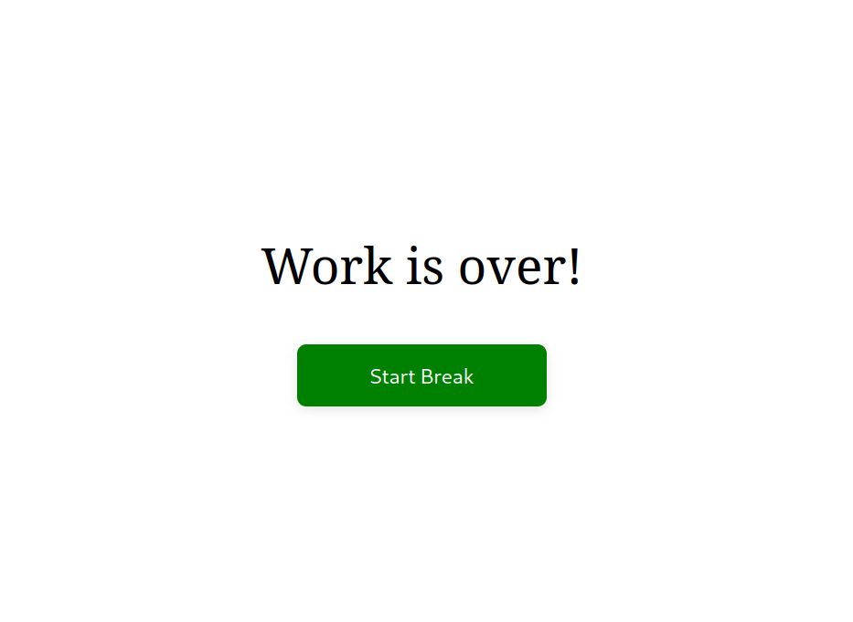
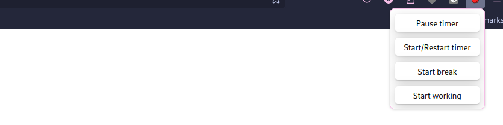

## Firefox pomodoro extension

Inspired by this Chrome extension: [Marinara Pomodoro Assistant](https://github.com/schmich/marinara.git).

## Features
- Creates new tab when timer is over
- <b>Allows toggling timer</b>: start break/work, pause and restart
- Can set work and break duration through extension options

## TODO
- Automatic timer
- Desktop notification

## Screenshots
| Timer Prompt |
|-|
|  |

| Popup |
|-|
|  |

| Options |
|-|
|  |

