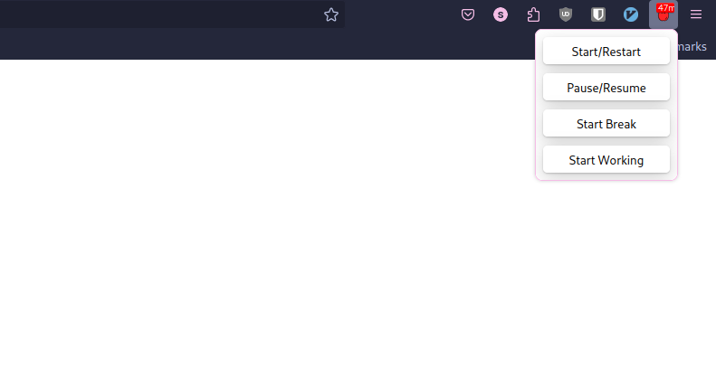

## Firefox pomodoro extension

Inspired by this Chrome extension: [Marinara Pomodoro Assistant](https://chromewebstore.google.com/detail/marinara-pomodoro%C2%AE-assist/lojgmehidjdhhbmpjfamhpkpodfcodef).

## Features
- Creates new tab when timer is over
- <b>Allows toggling timer</b>: start break/work, pause, restart
- Change duration for work, short break and long break
- Can set # of pomodoros before long break
- Desktop notification when time is over
- Option to Switch timer on automatically

## How to install
Install on Firefox Browser via [addons.mozilla.org](https://addons.mozilla.org/en-US/firefox/addon/fox-pomodoro/).

## Screenshots
| Options |
|-|
|  |

| Prompt |
|-|
|  |

| Toolbar Icon | Notification |
|-|-|
|  |  |

| Settings |
|-|
|  |

